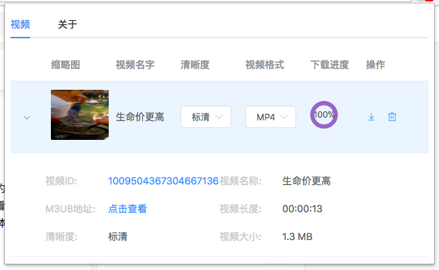
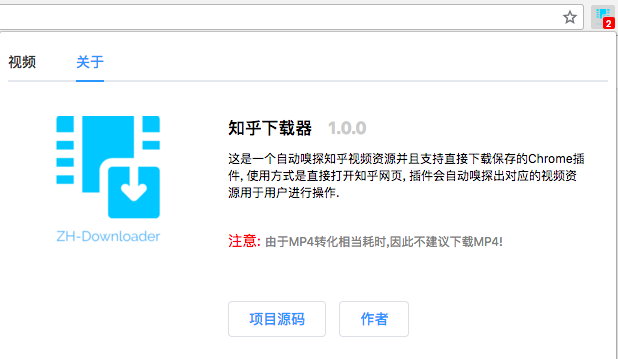

# Zh-Downloader

这是Chrome插件, 能进行知乎视频嗅探以及下载功能。支持下载为TS格式( MPEG2-TS 格式) 或者 MP4 格式,其中 MP4格式使用 [mpegts_to_mp4](https://github.com/RReverser/mpegts) 库完成。

# 使用说明

下载本代码之后执行 `npm install && npm run build` 之后在 [Chrome](chrome://extensions/)中选择"加载已解压的扩展程序" 选择 `dist` 目录即可。

# 功能特色

+ 所有知乎视频自动采集和嗅探,无需用户干预(badge上会提示用户多少视频,不会发通知打扰用户)
+ 视频信息(ID/视频原地址/封面图/大小/时长/名称/格式)等多规格一览无余
+ 多清晰度/多种格式提供下载
+ 支持自定义偏好设置,比如您可以自己设置用于转化MP4的转化器是什么,偏爱的默认格式是什么
+ 实时友好展示下载/转化进度
+ UI 不算太差
+ 纯前端Javascript实现
+ 最新采集的永远放在最前面
+ 自动重试机制(默认3次,每次重试间隔时间为5秒)
+ 我编不下去了...

# 技术

本次计划使用 Vue，因此选择了 [Kocal/vue-web-extension](https://github.com/Kocal/vue-web-extension) 模版

+ [Vue2.0](https://vuejs.org/)
+ [Element](http://element.eleme.io/#/zh-CN)
+ [m3u8-parser](https://github.com/videojs/m3u8-parser)
+ [mpegts_to_mp4](https://github.com/RReverser/mpegts)
+ [vuex-webextensions](https://github.com/MitsuhaKitsune/vuex-webextensions)

# 原理解释

本插件主要由 Popup Script 以及 Background Script 合作完成，参见:[Understanding Google Chrome Extensions](https://gist.github.com/jjperezaguinaga/4243341)

大体步骤:

-  使用 [chrome.webRequest.onBeforeRequest](https://developer.chrome.com/webRequest) 监听所有知乎发起的视频请求，根据简单抓包可以看到知乎当有视频的时候会向这个地址:[https://v.vzuu.com/video/ZHIHU_VIDEO_ID](https://v.vzuu.com/video) 发起请求，其中`ZHIHU_VIDEO_ID`即为知乎视频ID. 之后利用知乎 API: https://lens.zhihu.com/api/videos/ZHIHU_VIDEO_ID 找到视频的 m3u8 地址。

- 利用 [M3U8-Parser](https://github.com/videojs/m3u8-parser) 解析上述 API 返回的数据，并提交数据至 Popup 页面进行查看。

- 提交数据利用了 Vue 的 Store 状态管理，由于 Popup 生命周期的原因，因此将 Store 也存入了 localStorage 进行持久化, 插件是 `vuex-webextensions`。

- Popup(前端)接受用户下载请求，利用 `chrome.runtime.connect` 连接 Port 与 Background.js (后端)进行双向通讯，通知其下载请求。

- Background.js 遍历所有 TS 数据包并将起合并为一个 TS 包，如果发现下载的是 mp4 格式，则利用 `mpegts_to_mp4` 进行数据转化。

- 利用 Port 实时通知 Popup 页的下载进度以及下载结果。

> ⚠️ 注意:  MP4 尝试了`mpegts_to_mp4`， mux.js, videoconverter.js 效果均不是很理想。因此不建议下载MP4。

1. mpegts_to_mp4: 读取 SPS 信息的时候宽度/高度信息错误。
2. mux.js 能正常读取宽/高，但是无法正常解析Duration，另一个有趣的问题是部分知乎用户的视频没有音频，因此不会触发 mux.js 的 `data` 事件，因此需要分开处理音频/视频
3. videoconverter.js  Node 直接就爆内存错误

# 限制

1. 下载过程中不能关闭 Popup 页，否则后端无法与之通信然后通知下载结果
2. 嗅探的历史视频需要手动删除，否则知乎链接会过期，下载会出现403
3. 转化的MP4格式宽高不正确，因此普通视频播放器可能难以播放, 请尝试用 `mplayer` 播放。 或者下载 TS 之后用 `ffmpeg` 或者 [https://cloudconvert.com/](https://cloudconvert.com/) 在线转换
