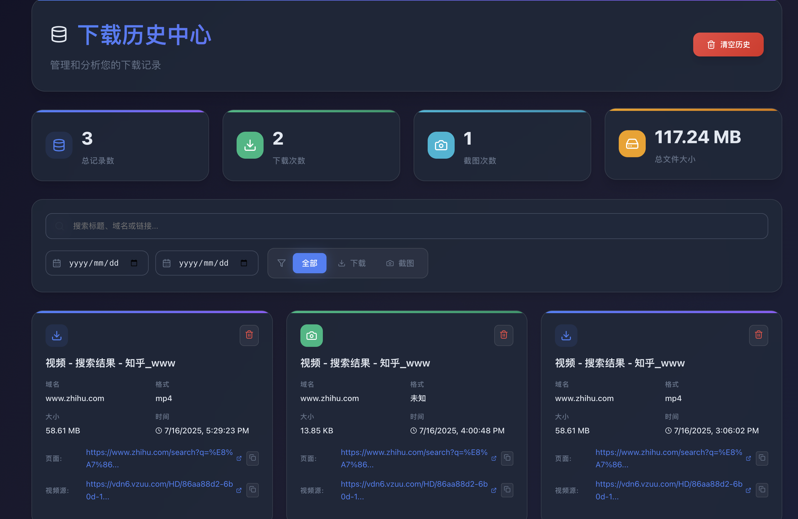

# 知乎视频下载器（zh-downloader）

> 🚀 基于 Manifest V3、TypeScript、React、Vite 的现代化 Chrome 视频下载插件  
> 仅专注于知乎的视频下载与截图，极简、好用、界面美观

更新原因参见 [shellvon/zh-downloader#issues33](https://github.com/shellvon/zh-downloader/issues/33)

新版本截图:




---

## ✨ 特性

- **支持 Manifest V3**：安全、现代、兼容 Chrome 最新扩展平台
- **极简 UI**：采用 React + TailwindCSS，界面科技感、现代化
- **一键下载**：支持 mp4/ogg 等主流格式视频的直接下载
- **任意帧截图**：可对当前视频任意时间点进行截图保存
- **智能元素选择**：可自定义标题选择器，适配复杂网页结构(WIP)
- **历史记录**：自动保存下载与截图历史，方便回溯
- **多主题支持**：亮色/暗色主题自由切换
- **高鲁棒性**：支持自定义选择器，兼容各种嵌套/动态/Shadow DOM 场景

---

## 🛠 技术栈

- [Manifest V3](https://developer.chrome.com/docs/extensions/mv3/)
- [TypeScript](https://www.typescriptlang.org/)
- [React 18+](https://react.dev/)
- [Vite](https://vitejs.dev/)
- [TailwindCSS](https://tailwindcss.com/)

---

## 📦 安装

1. **克隆仓库**

   ```bash
   git clone https://github.com/shellvon/zh-downloader.git
   cd zh-downloader
   ```

2. **安装依赖**

   ```bash
   yarn install
   # 或 npm install
   ```

3. **构建扩展**

   ```bash
   yarn build
   # 产物在 dist/ 目录
   ```

4. **加载到 Chrome**
   - 打开 `chrome://extensions/`
   - 开启「开发者模式」
   - 选择「加载已解压的扩展程序」，选择 `dist/` 目录

---

## 🖥️ 使用说明

- 点击浏览器右上角插件图标，弹出主界面
- 支持自动检测当前页面视频数量
- 支持自定义标题选择器，适配复杂网页
- 支持历史记录查看与配置导入/导出
- 支持亮/暗主题切换

---

## ⚡ 进阶配置

- **自定义选择器**
  - 针对特殊站点，可在「选项」页面自定义 `videoSelectors`、`titleSelectors`、`containerSelectors`
  - 支持 Shadow DOM、动态加载、非标准嵌入等复杂场景
- **只需选择标题**
  - 大多数情况下，视频元素自动识别，用户只需选择标题即可

---
