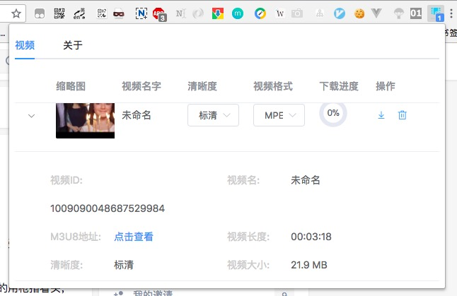

# Zh-Downloader

这是Chrome插件, 能进行知乎视频嗅探以及下载功能。支持下载为TS格式( MPEG2-TS 格式) 或者 MP4 格式,其中 MP4格式使用 mpets-to-mp4 库完成。

# 原理

监听 `chrome.webRequest.onBeforeRequest` 抓取知乎视频的信息, 然后利用 `m3u8-parser` 处理 M3U8 文件, 并将其中的每一个 TS 文件下载至本地即可。

# 截图

